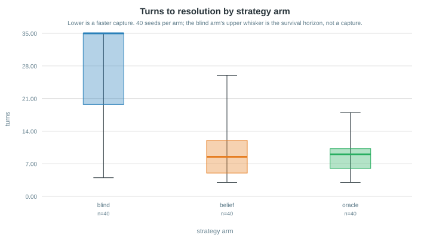
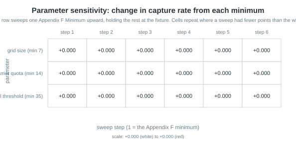
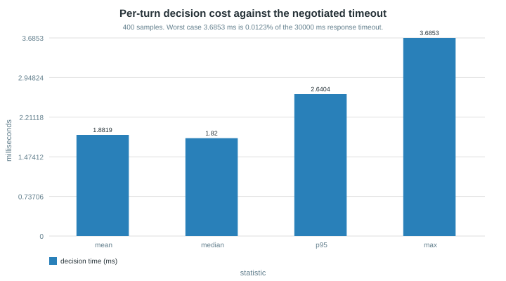
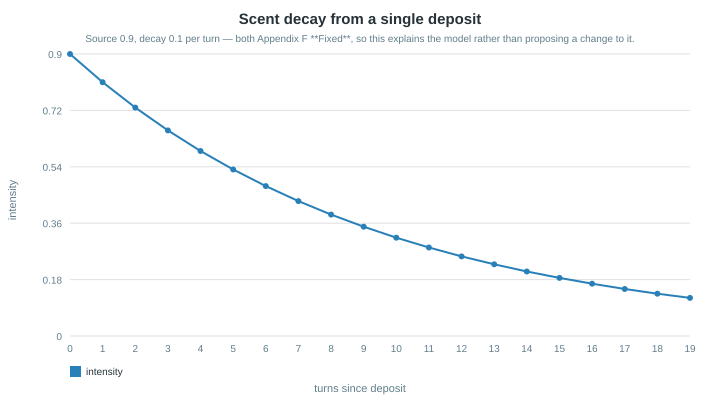

# Research report — parameter sensitivity and performance analysis

The book names this file directly (p.142/265) and sets its standard in one line: the
research must be **"based on numbers and not on guesses"** (p.142/266). Guidelines §9.1
asks for "systematic experiments with controlled changes to parameters", §9.3 for bar,
line, heatmap and box-plot visualisations, and `M9-06c` for "experiment tables with **run
counts**, not anecdotes".

Every number below was produced by `orchestration.harness.run_sub_game` refereeing real
matches. Nothing here is illustrative. To reproduce the whole report:

```text
uv run python scripts/run_experiments.py     # writes results/*.json
uv run python scripts/render_charts.py       # writes assets/chart-*.svg
```

## Protocol

| Aspect | Value |
|---|---|
| Board | the negotiated fixture, `shared_contract/fixtures/match_config.example.json` |
| Runs per measurement | **40 seeds** (`SEEDS = range(40)`) |
| Design | **paired** — seed *i* gives every arm and every configuration the identical Thief trajectory |
| Opponent | a seeded random legal walk that emits scent but does not react to the Cop |
| Cop's information | the 5×5 scent window only; never the referee's Thief position |
| Arms | `blind` (random legal move), `belief` (what we ship), `oracle` (perfect information) |

The oracle is **not a legal agent**. It is the ceiling, included so a reader can see how
much of the *available* gap belief closes rather than only that it beat random.

## 1. Strategy comparison (`M9-07a`)


| Arm | Capture rate | Mean turns | Mean Cop score | sd |
|---|---|---|---|---|
| blind | 0.225 | 32.83 | 8.38 | 6.34 |
| **belief** | **0.975** | **12.83** | **19.62** | **2.37** |
| oracle | 1.000 | 12.10 | 20.00 | 0.00 |

Belief-driven pursuit closes **96.8%** of the blind-to-oracle score gap. Paired seed by
seed it wins **30 of 40** and **loses 0**; the remaining 10 are ties. Against the oracle it
loses none and ties 39 of 40 — on this opponent, belief is within one seed of perfect play.


The distribution is where the mean would have misled. The blind arm's median score is
**5.0** with Q1 = Q3 = 5.0 — it is not a weak pursuer, it is *almost always a non-pursuer*
that occasionally stumbles into a capture. Its 8.38 mean is that rare success averaged over
many failures, and quoting the mean alone would describe an agent that does not exist.



Same story in the turn count: blind has median 35 (the survival horizon — i.e. no capture),
belief has median **11**.

## 1b. The opponent grid (`M9-30`) — every number above has an asterisk

**The opponent model was the untested half of section 1.** Every figure there is earned
against a seeded random walk — the weakest plausible Thief. Re-measured 2026-08-08 against
two deterministic fleeing archetypes (`scripts/experiment_opponents.py`,
`results/opponent_grid.json`; same 40 paired seeds):

| Cop arm | random walk | flee-greedy (reference shape) | flee-smart (distance+mobility) |
|---|---:|---:|---:|
| belief (pursuit only) | 40/40 | **0/40** | 0/40 |
| anticipating (pursuit only) | 40/40 | **0/40** | 0/40 |
| **barrier stack (what we serve)** | 39/40 | **40/40** | 0/40 |
| oracle (pursuit only, sees truth) | 40/40 | **0/40** | 0/40 |
| oracle + barrier stack | 40/40 | **40/40** | 0/40 |

Three findings, each carrying a design decision:

1. **Pursuit alone never captures a competent evader — the oracle included.** An
   equal-speed evader on an open board holds distance forever; the 96.7–97.5% headline is
   a property of the random walk, not of the pursuit. Barriers are the entire capture
   mechanism against real opposition, which is why the served policy is now the full
   trap → squeeze → containment-ratchet → anticipating-chase stack (`M6-21..23`), not
   `pursue_belief`.
2. **The stack converts the likeliest league opponent completely.** `flee_greedy` is the
   reference simulator's own `ThiefBrain` shape — maximise distance from the Cop — and the
   probable classmate default. 0/40 → **40/40**, at the cost of one game against the walk
   (39/40): the containment ratchet's wall turns stall pursuit exactly once in forty walks.
3. **`flee_smart` is an honest open boundary, and it is structural.** Distance *plus
   mobility* — the companion repository's own evasion shape — escapes every arm, including
   the barrier stack aimed with referee truth. The failure is not belief error (truth-aimed
   play changes nothing) and not fixable by more walls under this stack: the probe shows
   the terminal shape is a locked orbit the quota cannot cut fast enough. Recorded open,
   exactly as the companion records its anticipating-Cop gap; the two are the same
   phenomenon seen from opposite sides of the board.

Measured here and **reverted**: a Bayes-recursive belief (prior carried and multiplied
every turn) collapsed tracking — `flee_greedy` went 40/40 → 0/40 on that change alone.
Recursion under a static likelihood has no motion model, so history accumulates and the
argmax calcifies on old trail. Both live loops now rebuild belief fresh per observation and
carry the prior only across silent turns.

## 2. Parameter sweeps (`M9-06a`)

Appendix F marks each parameter `Fixed`, `Minimum` or `Negotiation`. Asked directly:
`Minimum` "may be raised by agreement but never lowered", so every sweep here runs **upward
from its minimum**. Sweeping below would study a configuration rule 12 forbids.



### 2.1 Survival threshold — the only Minimum that moves the outcome

| Threshold | Capture rate | Mean turns |
|---|---|---|
| 35 (minimum) | 0.975 | 12.82 |
| 45 | 1.000 | 12.85 |
| 55–75 | 1.000 | 12.85 |

One seed's Thief survives to turn 35 and is caught by turn 45. Raising the horizon past 45
changes nothing, because every capture that will happen has happened by then. **A longer
game favours the Cop, and the whole of that advantage is realised in the first ten extra
turns.**

### 2.2 Board size — flat, and the reason is not what it looks like

| Grid | Capture rate | Mean turns |
|---|---|---|
| 7×7 (minimum) | 0.975 | 12.82 |
| 8×8 – 12×12 | 0.975 | 13.03 |

A larger board should make capture harder. It does not, and the sweep alone cannot say why,
so `results/board_reach.json` measures it:

| Grid | Highest index the Thief ever reached | Available |
|---|---|---|
| 7×7 | 6 | 6 |
| 9×9 | 7 | 8 |
| 12×12 | **7** | 11 |

On a 12×12 board the outer four ranks are **never visited** in 40 matches. The start
positions (`thief_start (3,3)`, `cop_start (0,0)`) are `Negotiation` parameters held at the
fixture, and a 35-turn random walk from a fixed centre simply cannot reach the far edge.
So board size is not a lever *while the start positions are pinned* — the honest conclusion
is about the interaction, not about the board.

### 2.3 Barrier quota — flat because the measured arm never places a barrier

| Quota | Capture rate |
|---|---|
| 14 (minimum) – 30 | 0.975 (identical to four decimals) |

A perfectly flat line is a warning, not a result. `results/decision_mix.json` counts what
the arm actually decides:

```json
{"matches": 40, "decisions": 501, "by_type": {"Action": 501}, "barrier_intents": 0}
```

**Zero barrier intents in 501 decisions.** The belief arm is pursuit-only, so the quota
sweep was measuring an unused parameter. This is a real finding about our own agent:
`strategy/barrier_policy.py` and `strategy/squeeze.py` exist and are tested (`M6-06`), but
they are **not wired into the arm this comparison measures**. Reporting "barrier quota has
no effect" would have been false — the correct statement is that *this agent does not use
barriers*, and the quota's effect is therefore unmeasured.

## 3. Decision cost (`M6-13`)



| Statistic | Milliseconds |
|---|---|
| mean | 2.06 |
| median | 1.96 |
| p95 | 3.11 |
| **max** | **4.09** |
| Negotiated response timeout | 30 000 |

Worst case is **0.0136%** of the response-timeout budget, over 400 samples. The computational
fairness claim is therefore not close to contested: the agent could be 7 000× slower and
still answer inside the negotiated window.

## 4. The scent model (`M9-06b`)



Source intensity 0.9 and decay 0.10 per turn are both Appendix F **`Fixed`** — deviation
cancels the game under rule 23. The curve is published to *explain* the model, not to
propose retuning it: a single deposit falls below 0.1 after 21 turns, which is why a trail
stays informative for roughly two thirds of a minimum-length game.

## 5. Learning curves

The book requires learning curves **"if RL was used"** (p.81/189). This policy is
deterministic and weight-free — a fixed lexicographic ranking, no training, no parameters
fitted from data — so there is no convergence to plot. Asked directly, the book is *silent*
on what should replace the section for a deterministic policy.

Rather than leave it empty, §1's paired comparison is offered in its place: it is the same
question a learning curve answers — *is this policy actually better than the alternative,
and by how much* — settled by measurement rather than by asserting that it is.

## Threats to validity

Stated because the numbers above are strong, and strong numbers deserve their limits printed
next to them.

1. **One opponent.** Every measurement is against a seeded random walk that does not react
   to the Cop. A pursuing-aware Thief would evade, and belief's 96.8% gap closure is an
   upper bound on this opponent class only.
2. **No live opponent.** No counted league game has been played, so nothing here is
   evidence about a classmate's agent.
3. **The arm is not the whole agent.** As §2.3 shows, the measured arm excludes the barrier
   machinery the repository ships.
4. **40 seeds.** Enough for the paired result (30–0–10 is decisive), thin for the flat
   sweeps, where the honest claim is "no effect detected at n=40" rather than "no effect".
